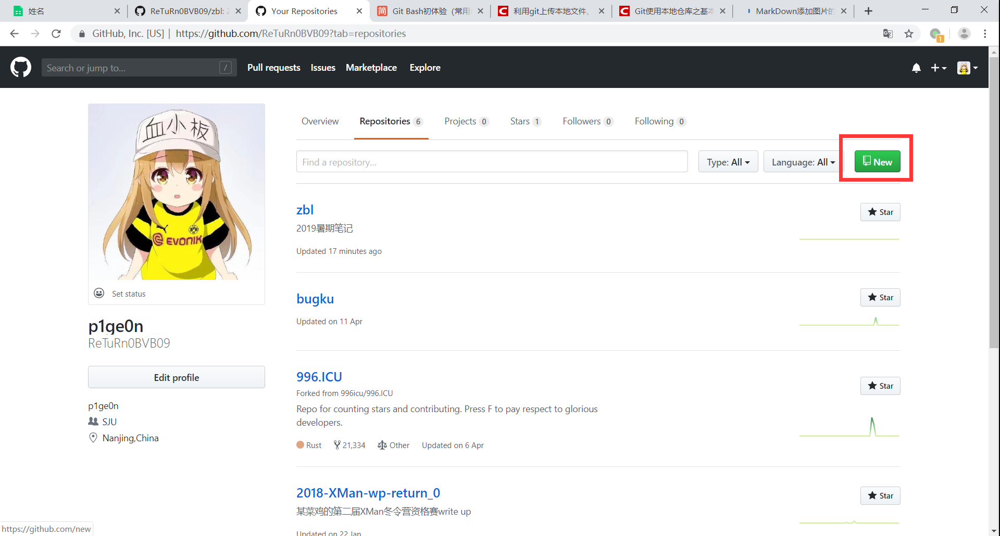
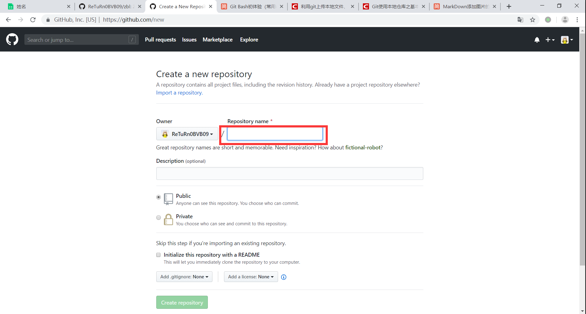

# README

## github仓库创建

点击图中的new  

  

<<<<<<< HEAD
     
=======
     
>>>>>>> e07979e114ff9eecea150adeb27046bcc28d4d25

在这里填入仓库名，创建仓库  

## git&&github

$ git config --global user.name "ReTuRn0BVB09"  

$ git config --global user.emali "return0_bvb@outlook.com"  

$ ssh-keygen -t rsa -C "return0_bvb@outlook.com"  

创建ssh密钥之后在github中配置即可  

创建本地文件夹zbl  

### 创建本地git仓库  

$ git init  

### 将本地文件加入到本地git仓库

$ git add README.md 0708  

### 输入本次的提交说明，准备提交暂存区中的更改的已跟踪文件，单引号内为说明内容：

$ git commit -m "Config"  

### 关联github仓库

$ git remote add origin https://github.com/ReTuRn0BVB09/zbl.git  

如果出现错误：fatal:remote origin already exists, 执行以下语句：

$ git remote rm origin  

然后重新关联  

### 上传到github

$ git push origin master  
